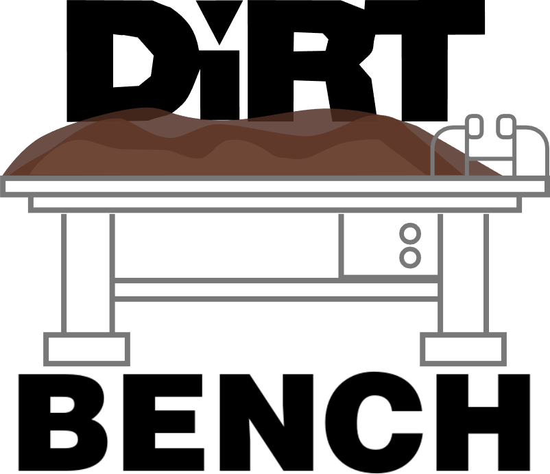

<p align="center">
  
</p>

<p align="center">Dirt 3 stage/venue creator.</p>

## Build

```
./download-deps.sh      # once: fetches and builds vendor/, for ./build.sh
./build.sh              # every test suite

./release.sh --local    # -> build/dirtbench
```

`release.sh` builds in a container (`docker/Dockerfile`, AlmaLinux 8) rather
than on your machine. glibc is never forward compatible, so a binary linked on
a current distribution starts only on a current distribution; building on 2.28
gives one that runs everywhere newer. It needs `docker` and `glslc`, keeps its
own `vendor-alma8/`, and refuses to finish if the glibc floor comes out wrong.

## Release

```
./release.sh --public --version 0.1.0 --notes "notes here"
```

Runs the `release` workflow on GitHub, which builds in the same image and
publishes a tarball. The version must match `VERSION` in `src/app/notice.odin`,
the tree must be clean, and HEAD must be pushed.

## Point it at the game

Put a `dirtbench.conf` next to the binary

```
install_dir = /path/to/DiRT 3 Complete Edition
```

## Make a stage

1. Start `dirtbench`. The project manager lists the game's venues and your own.
2. Make a venue. It holds your stages and borrows its art from a stock venue that you pick.
3. Open the venue. Draw any road network, terrain, trees.
4. Open/Add a stage. place a start and finish, use pins for a specific route.
5. Deploy/Update-in-game. The stage goes into the game, and you can drive it.

Stock venues are read-only. On the first export, each game file that dirtbench
replaces is copied to `<file>.orig`. A later export never touches that copy, so
`.orig` is always the stock file.

## Command line

```
dirtbench --version
dirtbench --notice                          # licence and third-party credits
dirtbench --venues                          # your venues
dirtbench --venue-new <id> --base <venue> [--name <shown>]
dirtbench --venue-deploy <id> [--apply]
dirtbench --venue-revert <id>
dirtbench --dirt3-venues                    # the game's venues, and the broken entries

dirtbench --export <stage> --venue <id> [--target gltf|dirt3] [--terrain]
                           [--debug-out]
dirtbench --pacenotes <venue> [--reverse]
```

An export goes into the game by default. `--debug-out` writes to `build/out/`
instead. glTF always goes there, because the game cannot read it.

## Huge thanks

- The [Ego-Engine-Modding](https://github.com/EgoEngineModding/Ego-Engine-Modding)
  team, for the database schema and for years of work on the Ego formats.
- [ssor0](https://github.com/ssor0), for the PSSG/vis/general format knowledge.
- [Deuterium, the Sentient Mattress](https://www.youtube.com/@DeuteriumtheSentientMattress/videos),
  for the co-driver voice.

## License

MIT, see `LICENSE`. Third-party code and data are listed in `credits.txt`.
Both are compiled into the binary; `dirtbench --notice` prints them.

dirtbench ships no DiRT 3 art, audio, geometry or level data. A venue's art is
taken out of your own install at export time.
